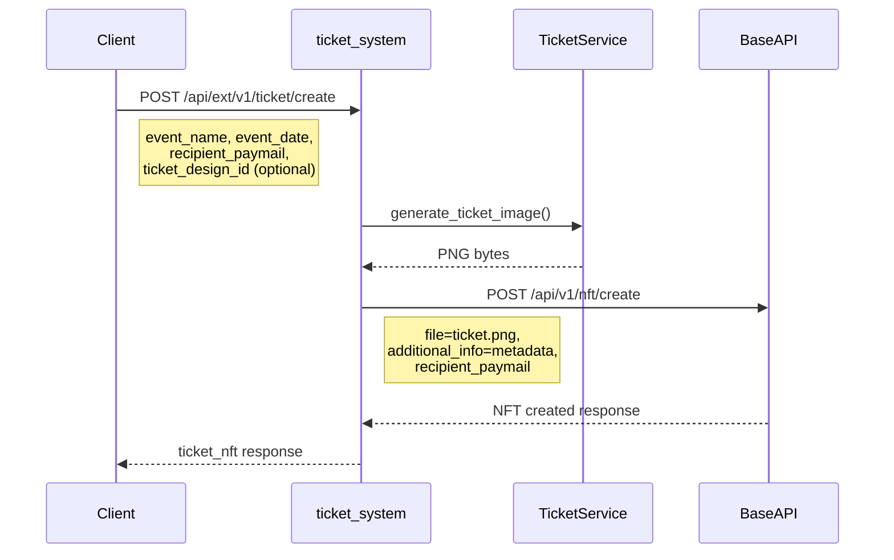

# チケットNFT作成API仕様書

この資料は、`v1-start` で「チケット作成APIの仕様を確認する辞書」として使います。  
実装は `documents/011_goal_steps_ai_pairing.md` のStep順で進め、仕様確認が必要になった時点で参照してください。

## 読み方

- まずは「3. ベースAPIとの整合性」と「5. リクエスト/レスポンス」を確認
- 次に「4. デザインテンプレート指定」で入力ルールを確認
- 実装が落ちる場合は「10. セキュリティ考慮事項」を見直す

AI相談テンプレ:

```text
チケット作成APIの実装中です。
仕様上の期待: ...
現在のリクエスト: ...
現在のレスポンス: ...
021_ticket_create_api_spec.md と照らして、差分と修正方針を教えてください。
```

## ドキュメント情報

| 項目 | 内容 |
|------|------|
| ドキュメントID | 007 |
| タイトル | チケットNFT作成API仕様書 |
| バージョン | 1.0 |
| 作成日 | 2026-01-26 |
| 最終更新日 | 2026-01-26 |

---

## 1. 概要

`ticket_system`に新しいAPI `POST /api/ext/v1/ticket/create` を追加し、チケットNFTの作成を簡素化する。

このAPIは以下の処理を自動化する：
1. チケット画像の生成（QRコード付き）
2. NFTメタデータの構築
3. ベースAPI経由でのNFT作成

---

## 2. アーキテクチャ



---

## 3. ベースAPIとの整合性

### 3.1 ベースAPI `POST /api/v1/nft/create` のパラメータ

| パラメータ | 型 | 必須 | 説明 |
|-----------|-----|------|------|
| `file` | File | Yes | NFTファイル（画像等） |
| `app` | string | Yes | アプリ名 |
| `name` | string | Yes | NFT名 |
| `additional_info` | string | No | JSON形式の追加メタデータ（subTypeDataに格納） |
| `recipient_paymail` | string | No | 受領者paymail（省略時は自分） |

### 3.2 新API `POST /api/ext/v1/ticket/create` のパラメータ

| パラメータ | 型 | 必須 | 説明 |
|-----------|-----|------|------|
| `event_name` | string | Yes | イベント名 |
| `event_date` | string | Yes | イベント日時（ISO 8601形式推奨） |
| `venue` | string | No | 会場名 |
| `seat` | string | No | 座席情報 |
| `recipient_paymail` | string | No | 受領者paymail（省略時は自分） |
| `ticket_design_id` | integer | No | 使用するTicketDesignのID |
| `ticket_design_name` | string | No | TicketDesignの名称（新規作成時のみ） |
| `ticket_design_layout` | string | No | TicketDesignのlayout（JSON文字列） |
| `template_image` | file | No | 背景画像（PNG/JPG） |
| `checkin_reward_image` | file | No | チェックイン報酬NFT用画像 |

---

## 4. デザインテンプレート指定

### 4.1 指定方法

`ticket_design_id` パラメータでデザインテンプレートを指定できる。

```json
// 例1: 特定のデザインを指定
{
  "event_name": "Summer Festival 2026",
  "event_date": "2026-08-15T18:00:00+09:00",
  "recipient_paymail": "user@example.com",
  "ticket_design_id": 2
}

// 例2: デザインを省略（アクティブなデザインを自動使用）
{
  "event_name": "Summer Festival 2026",
  "event_date": "2026-08-15T18:00:00+09:00",
  "recipient_paymail": "user@example.com"
}
```

### 4.2 処理ロジック

```python
ticket_design_id = request.data.get('ticket_design_id')

if ticket_design_id:
    # 指定されたIDのデザインを取得
    design = TicketDesign.objects.filter(id=ticket_design_id).first()
    if not design:
        return Response({"error": f"TicketDesign id={ticket_design_id} not found"}, status=400)
else:
    # アクティブなデザインを自動取得（なければNone）
    design = TicketDesign.get_active()
```

### 4.3 ticket_design_id未指定時の選択ルール

`ticket_design_id` を指定しない場合の挙動は以下のとおり：

1. `ticket_design_name` / `ticket_design_layout` / `template_image` / `checkin_reward_image` のいずれかが指定されている場合  
   → **新規 `TicketDesign` を作成して使用**
2. 上記がすべて未指定の場合  
   → **アクティブな `TicketDesign` を使用**
3. アクティブなデザインが存在しない場合  
   → **デフォルト背景でチケット画像を生成**

### 4.4 デザインがない場合

デザインが存在しない場合でも、デフォルトの背景（800x400px、ダークグレー）でチケット画像を生成可能。

### 4.5 背景画像・レイアウト・報酬NFT画像の登録

`multipart/form-data` で以下を送ると、チケット作成と同時にデザイン情報を登録できる。

#### 新規デザインを作成する場合

- `ticket_design_name` を指定すると新規 `TicketDesign` を作成する
- `template_image` がチケット背景画像
- `checkin_reward_image` がチェックイン報酬NFTの画像

#### 既存デザインを更新する場合

- `ticket_design_id` を指定すると既存 `TicketDesign` を更新する
- 画像やレイアウトは指定された項目のみ上書きされる

#### 画像パラメータ

| パラメータ | 説明 |
|-----------|------|
| `template_image` | チケット背景画像（PNG/JPG） |
| `checkin_reward_image` | チェックイン報酬NFTの画像 |

---

## 5. リクエスト/レスポンス

### 5.1 リクエスト例

```bash
curl -X POST 'https://ticket.buxbit.net/api/ext/v1/ticket/create' \
  -H 'Content-Type: application/json' \
  -H 'Cookie: sessionid=xxx; csrftoken=xxx' \
  -H 'X-CSRFToken: xxx' \
  -d '{
    "event_name": "Summer Festival 2026",
    "event_date": "2026-08-15T18:00:00+09:00",
    "venue": "Tokyo Dome",
    "seat": "A-15",
    "recipient_paymail": "user@example.com"
  }'
```

### 5.1.1 デザインと画像を同時登録する例（multipart/form-data）

```bash
curl -X POST 'https://ticket.buxbit.net/api/ext/v1/ticket/create' \
  -H 'Cookie: sessionid=xxx; csrftoken=xxx' \
  -H 'X-CSRFToken: xxx' \
  -F 'event_name=Summer Festival 2026' \
  -F 'event_date=2026-08-15T18:00:00+09:00' \
  -F 'venue=Tokyo Dome' \
  -F 'seat=A-15' \
  -F 'recipient_paymail=user@example.com' \
  -F 'ticket_design_name=Summer Design' \
  -F 'ticket_design_layout={"text":{"x":40,"y":40,"font_size":28},"qr":{"x":480,"y":40,"size":260}}' \
  -F 'template_image=@/path/to/background.png' \
  -F 'checkin_reward_image=@/path/to/reward.png'
```

### 5.2 成功レスポンス（201 Created）

```json
{
  "status": "success",
  "message": "Ticket NFT created successfully",
  "nft_origin": "abc123def456..._0",
  "transaction_id": "abc123def456...",
  "ticket_image_url": "/api/ext/v1/ticket/image/abc123def456..._0",
  "checkin_url": "https://ticket.buxbit.net/api/ext/v1/ticket/checkin?token=...",
  "nft_information": {
    "nft_id": 123,
    "nft_origin": "abc123def456..._0",
    "name": "Summer Festival 2026 Ticket",
    "metadata": {
      "map": {
        "app": "Ticket System",
        "name": "Summer Festival 2026 Ticket",
        "type": "ord",
        "subType": "collectionItem",
        "subTypeData": {
          "ticket": {
            "event_name": "Summer Festival 2026",
            "event_date": "2026-08-15T18:00:00+09:00",
            "venue": "Tokyo Dome",
            "seat": "A-15",
            "holder_paymail": "user@example.com"
          }
        }
      }
    }
  }
}
```

### 5.3 エラーレスポンス

#### 400 Bad Request - バリデーションエラー

```json
{
  "error": "event_name is required"
}
```

#### 400 Bad Request - デザインが見つからない

```json
{
  "error": "TicketDesign id=999 not found"
}
```

#### 401 Unauthorized - 認証エラー

```json
{
  "error": "Authentication required"
}
```

#### 500 Internal Server Error - NFT作成失敗

```json
{
  "error": "Failed to create NFT"
}
```

---

## 6. メタデータ構造

### 6.1 NFTメタデータ（additional_info）

チケットNFTのメタデータは以下の構造でベースAPIに送信される：

```json
{
  "ticket": {
    "event_name": "Summer Festival 2026",
    "event_date": "2026-08-15T18:00:00+09:00",
    "venue": "Tokyo Dome",
    "seat": "A-15",
    "holder_paymail": "user@example.com",
    "created_at": "2026-01-26T10:00:00Z"
  }
}
```

### 6.2 ベースAPIでの格納先

ベースAPIの`CreateNFTAPIView`は`additional_info`を`metadata.MAP.subTypeData`に格納する。

最終的なNFTメタデータ構造：

```json
{
  "map": {
    "app": "Ticket System",
    "name": "Summer Festival 2026 Ticket",
    "type": "ord",
    "subType": "collectionItem",
    "subTypeData": {
      "ticket": {
        "event_name": "Summer Festival 2026",
        "event_date": "2026-08-15T18:00:00+09:00",
        "venue": "Tokyo Dome",
        "seat": "A-15",
        "holder_paymail": "user@example.com",
        "created_at": "2026-01-26T10:00:00Z"
      }
    }
  },
  "insc": {
    "file": {
      "hash": "...",
      "size": 12345,
      "type": "image/png"
    }
  }
}
```

---

## 7. holder_paymail の自動設定

### 7.1 概要

`holder_paymail`は、チケットNFTの現在の所有者を示す重要なフィールド。チェックイン報酬NFTの送付先として使用される。

### 7.2 設定タイミング

1. **NFT作成時**: `recipient_paymail`が指定されている場合、`holder_paymail`として自動設定
2. **NFT転送時**: ベースAPIの`SendNFTPaymailAPIView`で転送先paymailを`holder_paymail`として更新

### 7.3 関連ドキュメント

詳細は `022_architecture_reference.md` の「holder_paymail の自動設定」セクションを参照。

---

## 8. 実装ファイル

| ファイル | 説明 |
|----------|------|
| `app/ticket_service/views.py` | `TicketCreateAPIView` クラス |
| `app/ticket_service/urls.py` | URLパターン追加 |
| `app/ticket_service/services/ticket_service.py` | 画像生成メソッド |
| `app/ticket_service/services/base_api_client.py` | `create_ticket_nft` メソッド |

---

## 9. 関連API

| API | 説明 |
|-----|------|
| `GET /api/ext/v1/ticket/image/{nft_origin}` | チケット画像取得 |
| `POST /api/ext/v1/ticket/checkin` | チェックイン処理 |
| `POST /api/v1/nft/create` | ベースAPIのNFT作成 |
| `PATCH /api/v1/nft/meta/{nft_origin}` | NFTメタデータ更新 |

---

## 10. セキュリティ考慮事項

### 10.1 認証

セッションクッキーによる認証が必要。ベースAPIへのリクエストにセッションクッキーが使用される。

### 10.2 CSRF

`X-CSRFToken`ヘッダーが必要（Swagger UIからのテスト時は`CsrfExemptSessionAuthentication`で免除）。

### 10.3 権限制御

環境変数 `TICKET_CREATE_REQUIRE_ADMIN` で権限を制御可能。

| 設定値 | 動作 |
|--------|------|
| `False` (デフォルト) | ログインユーザー全員がチケットNFTを作成可能 |
| `True` | 管理者（is_staff または is_superuser）のみ作成可能 |

#### 設定例

```bash
# .env ファイル
TICKET_CREATE_REQUIRE_ADMIN=False  # デフォルト: 全員許可
# TICKET_CREATE_REQUIRE_ADMIN=True  # 管理者のみ
```

#### 権限チェックの優先順位

1. セッションに保存されたユーザー情報（`base_api_user_info`）の `is_staff` / `is_superuser`
2. DjangoのUserモデルの `is_staff` / `is_superuser`

#### エラーレスポンス（403 Forbidden）

管理者権限が必要な場合に非管理者がアクセスした場合：

```json
{
  "detail": "You do not have permission to perform this action."
}
```


