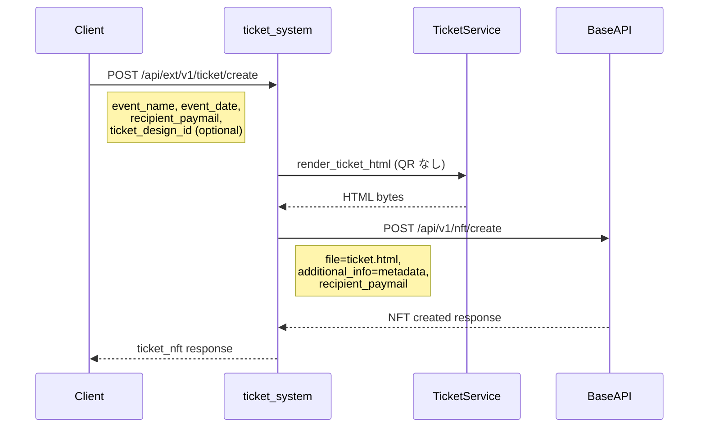

# チケットNFT作成API仕様書

この資料は、`v1-start` で「チケット作成APIの仕様を確認する辞書」として使います。  
実装は `documents/011_goal_steps_ai_pairing.md` のStep順で進め、仕様確認が必要になった時点で参照してください。

## 読み方

- まずは「3. ベースAPIとの整合性」と「5. リクエスト/レスポンス」を確認
- 次に「4. デザインテンプレート指定」で入力ルールを確認
- 実装が落ちる場合は「10. セキュリティ考慮事項」を見直す

AI相談テンプレ:

```text
チケット作成APIの実装中です。
仕様上の期待: ...
現在のリクエスト: ...
現在のレスポンス: ...
021_ticket_create_api_spec.md と照らして、差分と修正方針を教えてください。
```

## ドキュメント情報

| 項目 | 内容 |
|------|------|
| ドキュメントID | 007 |
| タイトル | チケットNFT作成API仕様書 |
| バージョン | 1.0 |
| 作成日 | 2026-01-26 |
| 最終更新日 | 2026-01-26 |

---

## 1. 概要

`ticket_system`に新しいAPI `POST /api/ext/v1/ticket/create` を追加し、チケットNFTの作成を簡素化する。

このAPIは以下の処理を自動化する：
1. チケット用 HTML の生成（背景・座席・日時・場所（住所）をインライン画像・テキストでレイアウト。**QR は含めない**）
2. NFT メタデータの構築（座席・日付・場所（住所）等は JSON で保持）
3. ベースAPI経由での NFT 作成（**アセットは HTML ファイル**。表示時に QR をレンダリングして返す）

---

## 2. アーキテクチャ



---

## 3. ベースAPIとの整合性

### 3.1 ベースAPI `POST /api/v1/nft/create` のパラメータ

| パラメータ | 型 | 必須 | 説明 |
|-----------|-----|------|------|
| `file` | File | Yes | NFT 用ファイル（拡張子付きであれば画像・HTML 等いずれも可） |
| `app` | string | Yes | アプリ名 |
| `name` | string | Yes | NFT名 |
| `additional_info` | string | No | JSON形式の追加メタデータ（subTypeDataに格納） |
| `recipient_paymail` | string | No | 受領者paymail（省略時は自分） |

### 3.2 新API `POST /api/ext/v1/ticket/create` のパラメータ

| パラメータ | 型 | 必須 | 説明 |
|-----------|-----|------|------|
| `event_name` | string | Yes | イベント名 |
| `event_date` | string | Yes | イベント日時（ISO 8601形式推奨） |
| `ticket_html` | file | Yes | チケット用HTML（スタイル含む） |
| `venue` | string | No | 会場名・場所（住所） |
| `seat` | string | No | 座席情報 |
| `recipient_paymail` | string | No | 受領者paymail（省略時は自分） |

---

## 4. チケットHTML（TicketDesign は使わない）

アップロードする HTML にスタイルが含まれるため、**TicketDesign は使わない**。`ticket_html` で渡した HTML をそのままベースに、API で受け取ったデータだけを埋め込む。

### 4.1 必須: ticket_html

- **ticket_html**: チケット用の HTML ファイル（必須）。CSS やインライン画像（base64）などスタイルをすべてこの HTML に含める。
- サーバ側では `{{ event_name }}`, `{{ event_date }}`, `{{ venue }}`, `{{ seat }}`, `{{ holder_paymail }}`, `{{ nft_metadata_json }}` のプレースホルダを置換し、`{{ background_block }}`, `{{ qr_block }}` は空で置換する。

### 4.2 HTML テンプレートのプレースホルダ

- **テキスト**: `{{ event_name }}`, `{{ event_date }}`, `{{ venue }}`, `{{ seat }}`, `{{ holder_paymail }}` を API の値で置換。
- **JSON**: `{{ nft_metadata_json }}` に MAP 形式のメタデータ（JSON 文字列）を埋め込む。
- **背景・QR**: `{{ background_block }}`, `{{ qr_block }}` は空文字。アップロード HTML 側で背景を用意する場合はそのまま記述し、プレースホルダがなければそのままでよい。

### 4.3 表示用 PNG について

QR 付きの表示用画像は **表示時**（`GET /api/ext/v1/ticket/image/{nft_origin}`）に、メタデータ ＋ TicketDesign（背景・layout）＋ QR を PIL で描画して返す。チケット作成時の NFT アセット（HTML）には TicketDesign は使わない。

### 4.4 WOC でチケット HTML を確認する

オンチェーン上の NFT データは **Ordinals のインスクリプション形式**（envelope: `ord` + content-type + body）で格納される。そのため生バイトの先頭には識別子や MIME タイプ（`text/html` など）のヘッダーが付き、その後に HTML 本体が続く。

**素の HTML だけを見たい場合**:
- **拡張API**: `GET /api/ext/v1/ticket/html/{nft_origin}` で、envelope を除いた HTML のみを取得できる。ログイン済みで取得し、ファイルとして保存してブラウザで開くと文字化けせず表示される。
- **WOC**: WOC のデコード機能で、content-type が `text/html` のインスクリプションから本文（body）だけを取り出して表示できる。

---

## 5. リクエスト/レスポンス

### 5.1 リクエスト例

```bash
curl -X POST 'https://ticket.buxbit.net/api/ext/v1/ticket/create' \
  -H 'Content-Type: application/json' \
  -H 'Cookie: sessionid=xxx; csrftoken=xxx' \
  -H 'X-CSRFToken: xxx' \
  -d '{
    "event_name": "Summer Festival 2026",
    "event_date": "2026-08-15T18:00:00+09:00",
    "venue": "Tokyo Dome",
    "seat": "A-15",
    "recipient_paymail": "user@example.com"
  }'
```

### 5.1.1 デザインと画像を同時登録する例（multipart/form-data）

```bash
curl -X POST 'https://ticket.buxbit.net/api/ext/v1/ticket/create' \
  -H 'Cookie: sessionid=xxx; csrftoken=xxx' \
  -H 'X-CSRFToken: xxx' \
  -F 'event_name=Summer Festival 2026' \
  -F 'event_date=2026-08-15T18:00:00+09:00' \
  -F 'venue=Tokyo Dome' \
  -F 'seat=A-15' \
  -F 'recipient_paymail=user@example.com' \
  -F 'ticket_design_name=Summer Design' \
  -F 'ticket_design_layout={"text":{"x":40,"y":40,"font_size":28},"qr":{"x":480,"y":40,"size":260}}' \
  -F 'template_image=@/path/to/background.png' \
  -F 'checkin_reward_image=@/path/to/reward.png'
```

### 5.2 成功レスポンス（201 Created）

```json
{
  "status": "success",
  "message": "Ticket NFT created successfully",
  "nft_origin": "abc123def456..._0",
  "transaction_id": "abc123def456...",
  "ticket_image_url": "/api/ext/v1/ticket/image/abc123def456..._0",
  "checkin_url": "https://ticket.buxbit.net/api/ext/v1/ticket/checkin?token=...",
  "nft_information": {
    "nft_id": 123,
    "nft_origin": "abc123def456..._0",
    "name": "Summer Festival 2026 Ticket",
    "metadata": {
      "map": {
        "app": "Ticket System",
        "name": "Summer Festival 2026 Ticket",
        "type": "ord",
        "subType": "collectionItem",
        "subTypeData": {
          "ticket": {
            "event_name": "Summer Festival 2026",
            "event_date": "2026-08-15T18:00:00+09:00",
            "venue": "Tokyo Dome",
            "seat": "A-15",
            "holder_paymail": "user@example.com"
          }
        }
      }
    }
  }
}
```

### 5.3 エラーレスポンス

#### 400 Bad Request - バリデーションエラー

```json
{
  "error": "event_name is required"
}
```

#### 400 Bad Request - デザインが見つからない

```json
{
  "error": "TicketDesign id=999 not found"
}
```

#### 401 Unauthorized - 認証エラー

```json
{
  "error": "Authentication required"
}
```

#### 500 Internal Server Error - NFT作成失敗

```json
{
  "error": "Failed to create NFT"
}
```

---

## 6. メタデータ構造

### 6.1 NFTメタデータ（additional_info）

チケットNFTのメタデータは以下の構造でベースAPIに送信される：

```json
{
  "ticket": {
    "event_name": "Summer Festival 2026",
    "event_date": "2026-08-15T18:00:00+09:00",
    "venue": "Tokyo Dome",
    "seat": "A-15",
    "holder_paymail": "user@example.com",
    "created_at": "2026-01-26T10:00:00Z"
  }
}
```

### 6.2 ベースAPIでの格納先

ベースAPIの`CreateNFTAPIView`は`additional_info`を`metadata.MAP.subTypeData`に格納する。

最終的なNFTメタデータ構造：

```json
{
  "map": {
    "app": "Ticket System",
    "name": "Summer Festival 2026 Ticket",
    "type": "ord",
    "subType": "collectionItem",
    "subTypeData": {
      "ticket": {
        "event_name": "Summer Festival 2026",
        "event_date": "2026-08-15T18:00:00+09:00",
        "venue": "Tokyo Dome",
        "seat": "A-15",
        "holder_paymail": "user@example.com",
        "created_at": "2026-01-26T10:00:00Z"
      }
    }
  },
  "insc": {
    "file": {
      "hash": "...",
      "size": 12345,
      "type": "image/png"
    }
  }
}
```

---

## 7. holder_paymail の自動設定

### 7.1 概要

`holder_paymail`は、チケットNFTの現在の所有者を示す重要なフィールド。チェックイン報酬NFTの送付先として使用される。

### 7.2 設定タイミング

1. **NFT作成時**: `recipient_paymail`が指定されている場合、`holder_paymail`として自動設定
2. **NFT転送時**: ベースAPIの`SendNFTPaymailAPIView`で転送先paymailを`holder_paymail`として更新

### 7.3 関連ドキュメント

詳細は `022_architecture_reference.md` の「holder_paymail の自動設定」セクションを参照。

---

## 8. 実装ファイル

| ファイル | 説明 |
|----------|------|
| `app/ticket_service/views.py` | `TicketCreateAPIView` クラス |
| `app/ticket_service/urls.py` | URLパターン追加 |
| `app/ticket_service/services/ticket_service.py` | 画像生成メソッド |
| `app/ticket_service/services/base_api_client.py` | `create_ticket_nft` メソッド |

---

## 9. 関連API

| API | 説明 |
|-----|------|
| `GET /api/ext/v1/ticket/image/{nft_origin}` | チケット画像取得 |
| `POST /api/ext/v1/ticket/checkin` | チェックイン処理 |
| `POST /api/v1/nft/create` | ベースAPIのNFT作成 |
| `PATCH /api/v1/nft/meta/{nft_origin}` | NFTメタデータ更新 |

---

## 10. セキュリティ考慮事項

### 10.1 認証

セッションクッキーによる認証が必要。ベースAPIへのリクエストにセッションクッキーが使用される。

### 10.2 CSRF

`X-CSRFToken`ヘッダーが必要（Swagger UIからのテスト時は`CsrfExemptSessionAuthentication`で免除）。

### 10.3 権限制御

環境変数 `TICKET_CREATE_REQUIRE_ADMIN` で権限を制御可能。

| 設定値 | 動作 |
|--------|------|
| `False` (デフォルト) | ログインユーザー全員がチケットNFTを作成可能 |
| `True` | 管理者（is_staff または is_superuser）のみ作成可能 |

#### 設定例

```bash
# .env ファイル
TICKET_CREATE_REQUIRE_ADMIN=False  # デフォルト: 全員許可
# TICKET_CREATE_REQUIRE_ADMIN=True  # 管理者のみ
```

#### 権限チェックの優先順位

1. セッションに保存されたユーザー情報（`base_api_user_info`）の `is_staff` / `is_superuser`
2. DjangoのUserモデルの `is_staff` / `is_superuser`

#### エラーレスポンス（403 Forbidden）

管理者権限が必要な場合に非管理者がアクセスした場合：

```json
{
  "detail": "You do not have permission to perform this action."
}
```


